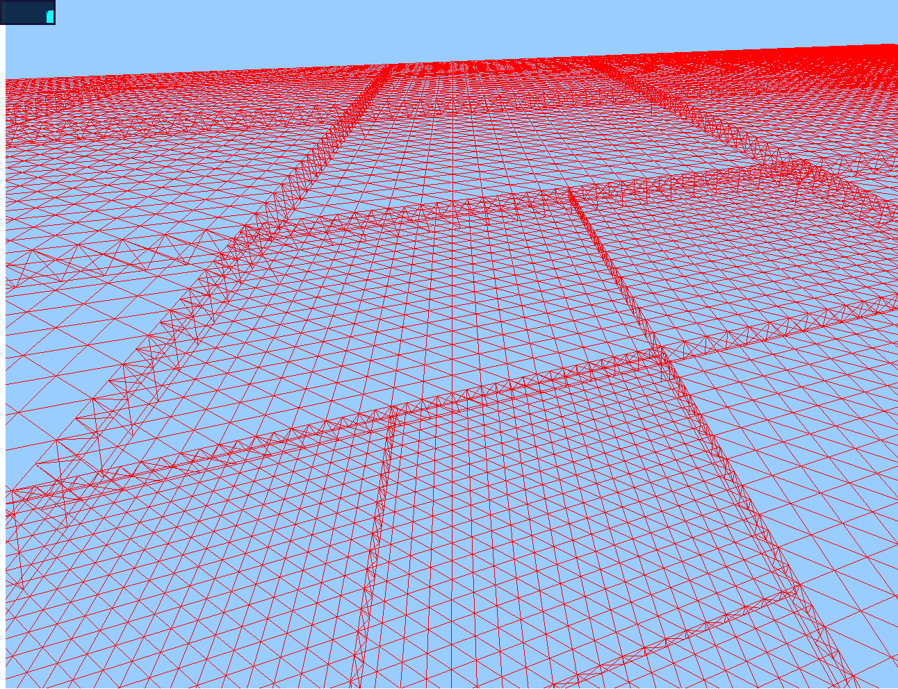
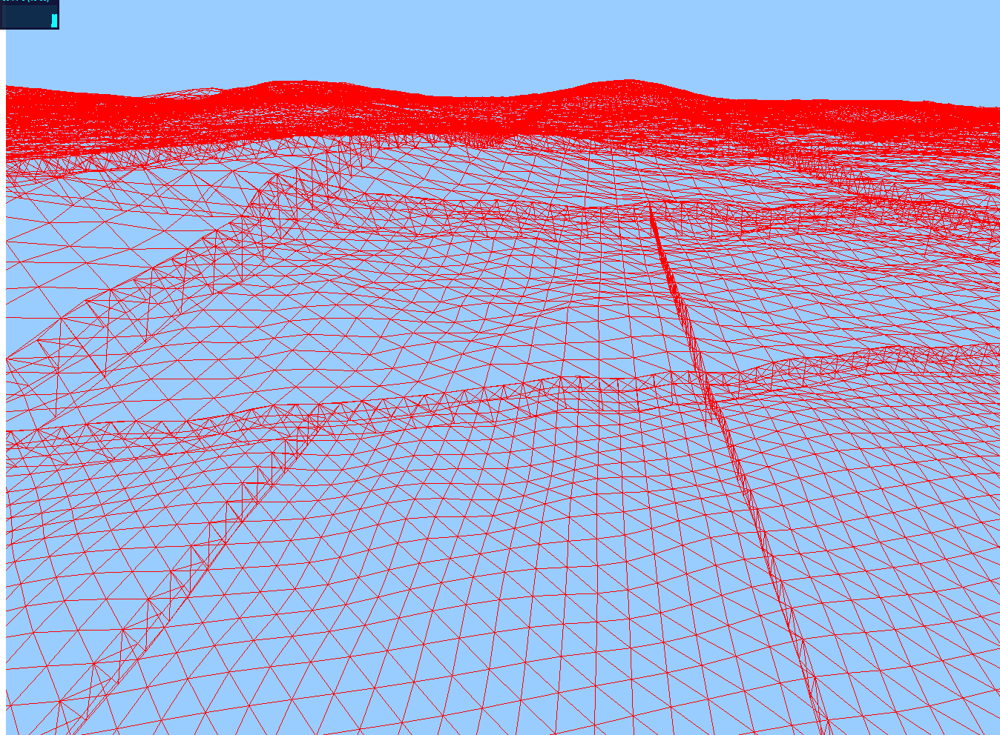

# Développement d'une simulation de vol avec ThreeJS

## Présentation

### Objectifs principaux

- Avoir un monde pseudo-infini généré en temps réel
- Modèle de vol arcade
- Generation de structures au sol (aéroports)

### Objectifs secondaires / optionnels

- Combats aériens
- Shaders avancés pour l'atmosphère
- Collisions physiques 
- IAs
- Multijoueur

## Développement

### Génération du terrain (voir src/landscape.js)

#### Génération du maillage

Quand on veut afficher un terrain détaillé à très grande distance il est nécessaire d'avoir connaissance de plusieurs contraintes techniques.
- Le GPU est limité en nombre de polygones à l'écran (quelques millions tout au plus)
- Le terrain doit garder une définition élevée pour afficher des détails de près
- L'opération de création d'un maillage 3D est relativement lourde. Il faut donc éviter de créer un maillage avec trop peu de triangles car peu rentable, et éviter de créer des maillages trop gros car très lourds à générer.

Partant de ca, il faudra un système qui découpe le terrain en plusieurs zones plus ou moins détaillées en fonction de la distance à la caméra. Ce système devra aussi générer des zones avec un maillage de complexité constante afin d'éviter les freezes intempestifs (un bon réglage de la complexité permettant une charge cpu minimale).

Pour ce genre de problèmes, la solution la plus indiquée est un quad tree, c'est-à-dire un arbre 2D où chaque section de l'arbre peut être subdivisée (=découpée) en 4 sous-zones a chaque fois 2x plus petites.

 *schémas récapitulatif d'un quadtree*

Comme expliqué dans les contraintes listées ci-dessus, on ne peut pas se permettre d'afficher un carré par noeud du quadtree. Un réglage qui m'a semblé être assez performant sur navigateur consiste en des sections de 20 x 20 carrés.

Seulement, le fait d'avoir des noeuds à différents niveaux de détails conjoints peut être assez problématique, et on peut voir par endroit des trous apparaitre comme montré ci-dessous.

 *Exemple de trous de couture aux jointures entre différents niveaux de noeuds*

Pour palier à ce problème il existe différentes techniques. La plus évidente serait de simplement redresser les sommets là où il y a des trous, seulement ce genre de calcul peut être assez lourd, et certains cas particuliers sont assez complexes à résoudre.

Une seconde approche (utilisée dans l'Unreal engine 4) serait de déformer le terrain en temps réel afin de 'joindre' progressivement les sommets au niveau des transitions de niveau de détail. Cette approche a l'avantage d'être très propre et ne laisse apparaitre aucune transition. Le soucis, c'est qu'en javascript ce genre d'algorithme risque d'être très gourmand.

Une troisième, peu être moins intuitive (utilisée dans Flight simulator 2020 par exemple), consiste à laisser 'dépasser les bords de la nape'.
Il se trouve que rajouter quelques polygones a un cout relativement faible. Au lieu de générer une grille de nxn sommets, on génère une grille de (n + 2) x (n + 2).
On se retrouve alors avec une 'nappe' qui déborde d'une cran de trop de chaque coté de la section. Il suffit alors de rabattre les bords vers le bas afin de cacher les éventuels trous. Cette approche est sans doute légèrement moins optimisée coté CPU, elle a l'avantage d'être très simple à mettre en place et d'avoir un cout très faible pour le CPU.

Comme nous travaillons sur un langage interprété, donc relativement lent, j'ai opté pour la 3e méthode. (aussi par sa simplicité).

 *Génération du maillage d'un noeud de l'octree*
 *Génération et subdivision de plusieurs sections de landscape*

[TODO] Parler de l'exemple d'algo de génération du maillage

#### Déformation du terrain

Comme la génération du terrain est totalement dynamique, on ne peut plus se baser sur une texture statique pour définir la hauteur du terrain. Il va donc falloir utiliser une fonction qui produit une altitude a partir d'une position de manière a avoir quelque chose d'intéressant visuellement.
Pour ce genre d'opération, on utilise habituellement un bruit de perlin.

 *Exemple d'image générée avec un bruit de perlin*

En combinant ce bruit avec lui-même à différentes échelles, on peut produire une heightmap infinie simulant un relief simple (il est très difficile de simuler une érosion sur ce genre de terrain, on ferra sans).
Il ne reste plus qu'à appliquer cet algorithme à la generation du maillage :

 *Quelques collines basiques*

#### Shaders du terrain

Maintenant qu'on a un terrain qui se génère, il serait intéressant d'avoir une surface plus jolie.
Il va donc falloir écrire un shaders.

[TODO] Detailler le shaders de terrain

#### Oceans

[TODO] Oceans dans le shaders

#### Génération du foliage

[TODO] foliage quad trees

[TODO] Octahedral impostors

#### Génération des structures

[TODO] Deformation du terrain pour accueuillir les structures

### Modèle de vol

[TODO] Simulation de vol