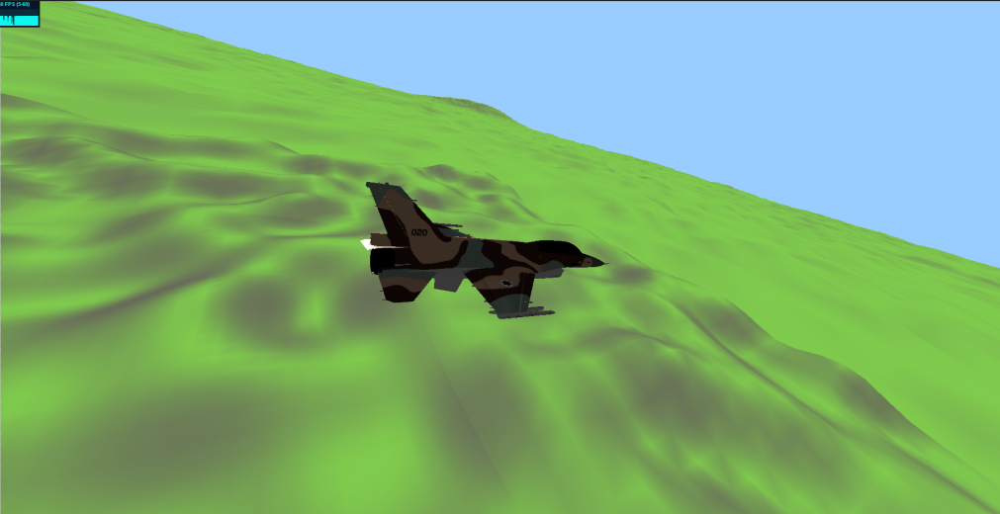
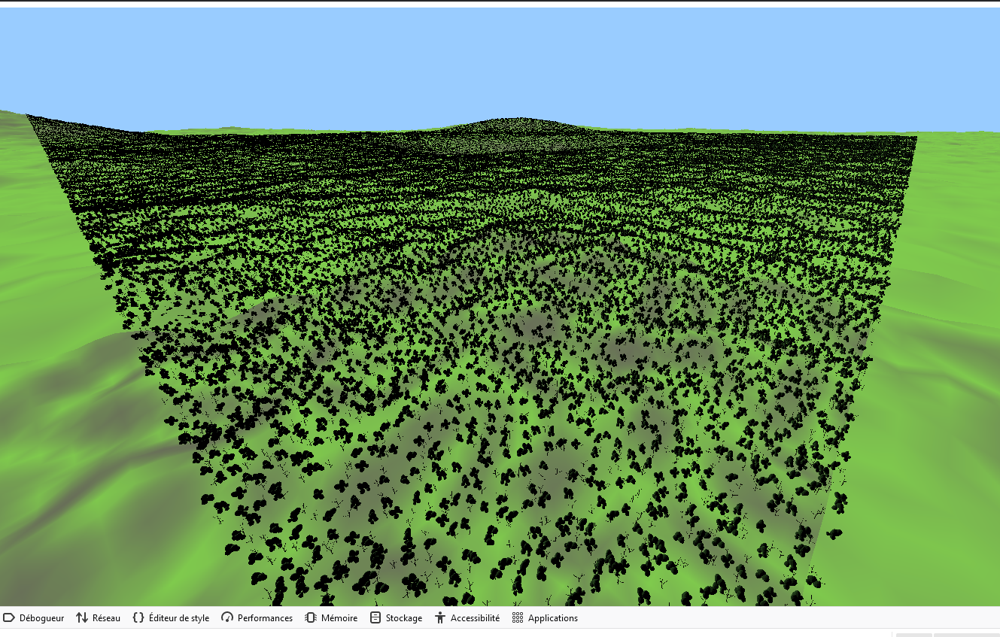
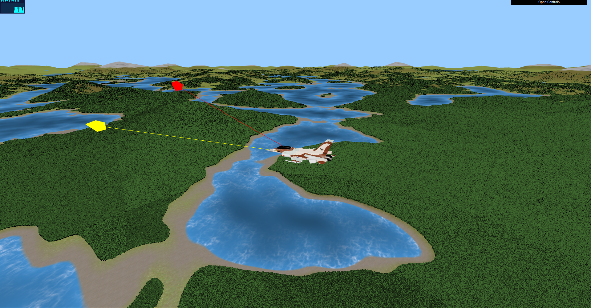
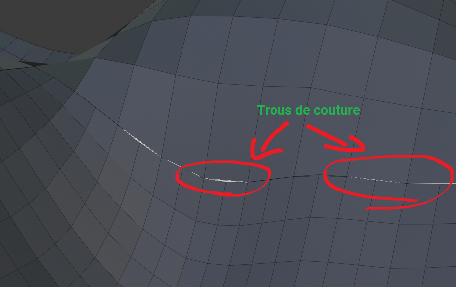
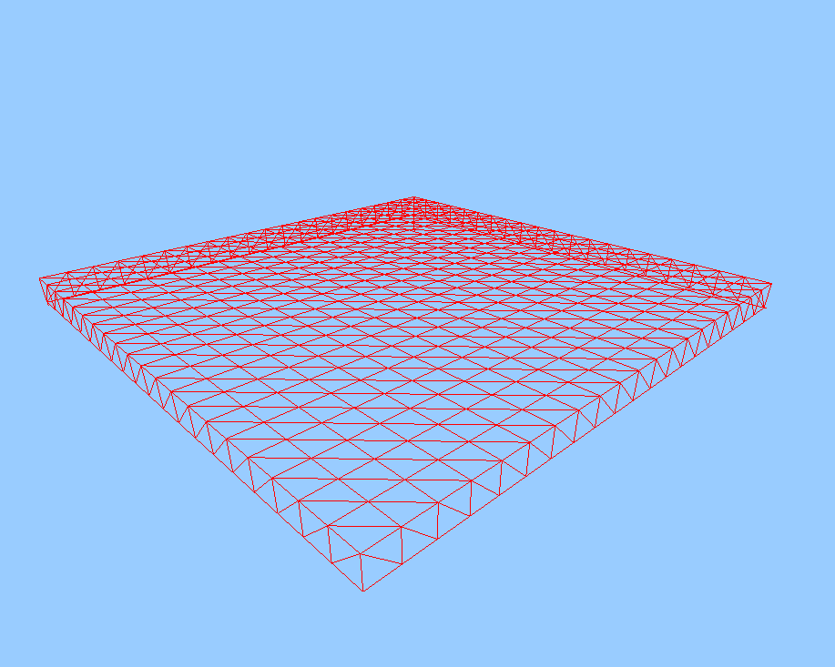
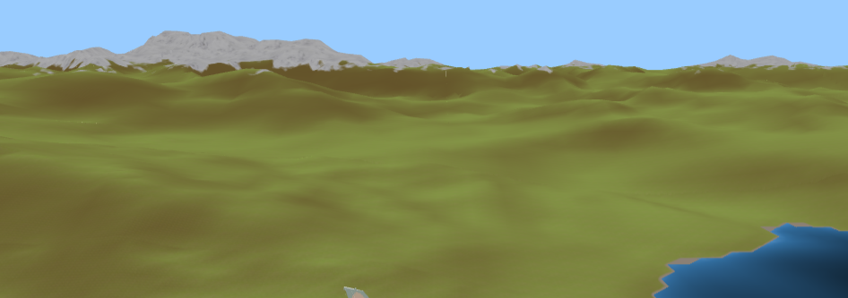

# Développement d'une simulation de vol avec ThreeJS

## Présentation du projet

Le cours de P4x traitant un sujet que je maitrise déjà bien, j'ai voulu en profiter 
pour faire des recherches et perfectionner mes connaissances dans le domaine via un unique projet que je détaillerais ici.


### Objectifs principaux

- Perfectionner mes compétences en programmation shaders GLSL
- Développer un petit simulateur de vol sur navigateur (idéalement capable de tourner sur mobile tant qu'à faire)
- Avoir un monde pseudo-infini généré en temps réel (amélioration de mes précédentes tentatives)
- Génération d'une végétation dense et légère en performances 
- Generation de structures simples au sol (aéroports notamment)
- Modèle de vol simplifié d'un avion
- Shaders d'atmosphère avancés
- Me former aux technologies du web (pour la culture générale, je ne compte pas m'y attarder plus que ca dans le futur)

### Objectifs secondaires et optionnels

- Outils de level design pour paramétrer les algorithmes de generation procéduraux
- Gameplay / Combats aériens (Démo technique avant tout, le jeu est plus secondaire)
- Collisions physiques
- IAs
- Multijoueur
- Génération de structures avancées (villes / routes)

## Développement

### Gestion des ressources

Un point assez pénible qui m'a rapidement posé problème, c'est le chargement des ressources avec
ThreeJS. En effet, le fait que tous les assets (meshs / textures ...) soient chargés en asynchrone
rend le développement d'un jeu avec beaucoup de ressources assez complexe à gérer.

J'ai donc décidé en tout premier lieu de mettre en place un système de gestion des ressources
qui répertorie et charge mes modèles avant de lancer la boucle de rendu.

Grace à ce système, j'ai juste à lister les dépendances à charger, puis à attendre que le chargement
de toutes les resources nécessaires soit fini pour lancer la boucle de rendu.

```javascript
RESOURCE_MANAGER.loadMeshResource('./models/F-16/F-16.glb', 'modele_F16');

function preInit() {
  if (RESOURCE_MANAGER.isLoadingResource()) requestAnimationFrame(preInit);
  else  init();
}
```

Pour ce qui est des formats d'objets 3D, je restreins le système au format gltf (avec une préférence pour le .glb),
car celui-ci a l'avantage d'avoir ses données en binaire et non en texte clair comme du .obj,
ce qui permet un chargement plus rapide et des fichiers plus légers. Un autre avantage
est aussi le fait que le glb embarque toutes ses dépendances à l'intérieur du fichier, ce qui évite
tout problème de chemins relatifs.
(j'ai aussi une forte préférence pour les formats open-source, de plus j'ai déjà écrit un loader
gltf il y a peu pour mon moteur C++, mon choix a donc vite été fait)

### Débuts dans ThreeJS

La gestion des ressources étant maintenant grandement facilitée, j'ai pu commencer à charger
quelques modèles pour faire quelques tests.

Une petite recherche rapide sur google m'a permis de trouver un modèle d'avion potable (je ferrais peu etre
un modèle plus détaillé plus tard si j'ai le temps et la motivation).
Etant habitué à utiliser des softs 3D modernes, j'ai décidé de ne pas utiliser le système
de coordonée par défaut de ThreeJS (Y-up), mais plutot du Z-up, plus standard dans les moteurs
3D (J'ai constaté que le Y-up etait souvent un héritage des jeux 2D, avec la profondeur en Z).

Je me retrouve donc avec un avion qui "vole" et un controleur qui me permet d'orbiter autours
et d'avoir une vue embarquée
 *J'en ai aussi profité pour entamer mes recherches sur le landscape, j'y reviendrais plus bas*

### Foliages

C'est déjà bien, et je perçois mieux le potentiel de ThreeJS. Je décide donc d'importer le premier
modèle d'arbre qui me tombe sous la main (un feuillu low-poly que j'avais fait pour un projet de l'an dernier)

Pour afficher un objet en masse, il n’y a pas de secrets, il faut instancier.
 *quelques milliers d'arbres plus tard...*

Pour éviter l'effet "forêt d'épicéas", j'ajoute un random à la position de mes instances pour les dispercer un peu... Sauf que mon arbre
est en 2 meshes... et qu'on ne peut pas spécifier la seed d'un random JS pour faire apparaitre les 2 bouts au "même random".
C'est pas très grave, je laisse tel quel en attendant une version propre.

Même si ca tourne bien sur mon PC principal, je suis tout de même mitigé sur les performances.
En effet, sur le GPU intégré de mon PC portable, je ne peux pas dépasser une zone de 100x100 arbres pour garder la tête au dessus des 60 fps.
La machine a beau être mauvaise, c'est peu !

Je commence à faire des tests pour ajouter de simples billboard, et je me rappelle alors d'un
[article](https://www.shaderbits.com/blog/octahedral-impostors) qui présentait une sorte de billboard amélioré au rendu assez impressionant.

Je commence donc à faire quelques tests, et c'est sans attentes. Passer de mon modèle mal optimisé
à un simple plan me permet de passer de quelques dizaines de milliers à plusieurs dizaines de millions
d'instances pour un cout dérisoire et très peu de contraintes. (Pas besoin de LODs, l'affichage reste correcte même à quelques dizaines de mètres)
 *Je crois que j'ai un peu abusé sur la quantité*

L'idée est là, mais il reste des problèmes de transformation sur les octahedral impostors. Je vais continuer à y réfléchir pendant que j'avance
sur le reste. En attendant ça fait à peu près le café comme on dit.


### Génération du terrain (voir src/landscape.js)

#### Génération du maillage

Quand on veut afficher un terrain détaillé à très grande distance il est nécessaire d'avoir
connaissance de plusieurs contraintes techniques.
- Le GPU est limité en nombre de polygones à l'écran (quelques millions tout au plus)
- Le terrain doit garder une définition élevée pour afficher des détails de près
- L'opération de création d'un maillage 3D est relativement lourde. Il faut donc éviter de
  créer un maillage avec trop peu de triangles car peu rentable au niveau du ratio drawcall / polygone
  , et éviter de créer des maillages trop gros car très lourds à générer.

Partant de ca, on va chercher à réaliser un système qui découpe le terrain en plusieurs zones plus ou moins
détaillées en fonction de la distance à la caméra, sachant que l'idéal consiste à 
d'avoir une densité de polygone / pixel à l'écran constante et inferieure à 1 pour notamment eviter l'overdraw (gaspillage de ressources)


Pour ce genre de problèmes, la solution la plus indiquée est d'utiliser un quad tree,
c'est-à-dire un arbre 2D où chaque section de l'arbre peut être subdivisée (=découpée)
en 4 sous-zones a chaque fois 2x plus petites.

 *schémas récapitulatif d'un quadtree*

Ensuite, comme expliqué dans les contraintes listées ci-dessus, on ne peut pas se permettre 
d'afficher un polygone par noeud du quadtree. Un réglage qui m'a semblé être assez performant 
sur navigateur consiste en des sections de 20 x 20 polygones (un polygone = 1 carré = 2 triangles).

*(La génération d'un tel maillage est relativement simple, on génère tout d'abord une grille de sommets,
puis on génère une liste de numéros de sommets qui indique comment relier les triangles à afficher.)*


Seulement, le fait d'avoir des noeuds à différents niveaux de détails conjoints peut être assez
problématique, et on peut voir par endroit des trous apparaitre comme montré ci-dessous.

 *Exemple de trous de couture aux jointures entre différents niveaux de noeuds*

Pour pallier à ce problème il existe différentes techniques. La plus évidente serait de simplement 
redresser les sommets là où il y a des trous, seulement ce genre de calcul peut être assez lourd,
et certains cas particuliers sont assez complexes à résoudre.

Une seconde approche (utilisée dans l'Unreal engine 4) serait de déformer le terrain en temps réel
afin de 'joindre' progressivement les sommets au niveau des transitions de niveau de détail. 
Cette approche a l'avantage d'être très propre et ne laisse apparaitre aucune transition brutale.
Le soucis, c'est qu'en javascript ce genre d'algorithme risque d'être très gourmand.

Une troisième, peu être moins intuitive (utilisée dans Flight simulator 2020 par exemple),
consiste à laisser 'dépasser les bords de la nape'.
Il se trouve que rajouter quelques polygones a un cout relativement faible. 
Au lieu de générer une grille de n x n sommets, on génère une grille de (n + 2) x (n + 2) sommets.
On se retrouve alors avec une 'nappe' qui déborde d'une cran de trop de chaque coté de la section. 
Il suffit alors de rabattre les bords vers le bas afin de cacher les éventuels trous. Cette approche 
est sans doute légèrement moins optimisée coté GPU, cependant elle a l'avantage d'être très simple à
mettre en place et d'avoir un cout très faible pour le CPU.

Comme nous travaillons sur un langage interprété, donc relativement lent, j'ai opté pour la 3e méthode.
(aussi par sa simplicité).

 *Génération du maillage d'un noeud de l'octree*
 *Génération et subdivision de plusieurs sections de landscape*

#### Déformation du terrain

Comme la génération du terrain est totalement dynamique, on ne peut plus se baser sur une texture
statique pour définir la hauteur du terrain. Il va donc falloir creer une grosse fonction procédurale
qui produit une altitude a partir d'une position.
Ce genre de fonction magique peut etre produite via la superposition de plusieurs bruits de perlin par exemple.

 *Exemple d'image générée avec un bruit de perlin*

> Ce genre de fonction étant très courrant, je me suis pas embété à l'implementer. Je me suis donc servis de la librairie
[Fast Noise](https://github.com/Auburn/FastNoise) d'Auburn que j'avais déjà utilisé dans d'autres projets similaires.

En combinant ce bruit avec lui-même à différentes échelles, on peut produire une heightmap infinie 
simulant un relief simple (il est très difficile de simuler une érosion sur ce genre de terrain, 
on ferra sans). Il ne reste plus qu'à appliquer cet algorithme à la generation du maillage :

 *Quelques collines basiques*


#### Shaders du terrain

Texturer une surface aussi immense est un peu plus complexe qu'un simple placage de textures. En effet,
les distances imposeraient une résolution tout simplement irréaliste, et l'utilisation d'une texture
trop petite laisserait rapidement apparaitre des répétitions.
Il va donc falloir écrire un shader.

Pour le moment, on se contentera d'une shader assez basique. Dans celui ci on définira quelques couches simples : 
- Texture de neige au dessus de 2500m
- Texture d'eau au niveau 0
- Texture d'herbe autrement, mélangée avec des zones plus rocailleuses sur les pentes plus inclinées.

Pour éviter les séparations nettes, on ferra des interpolations entre les differentes zones pour des transitions douces.
La detection des pentes elle repose simplement sur un produit scalaire entre un vecteur (0,0,1) et le vecteur normal de la surface.

 *Une première version du shader de terrain*

#### Oceans

Sur les OpenWorlds, les surfaces aquatiques sont rapidement problématiques.
En effet, leur forte proximité avec le sol au niveau des plages rend le travail
du z-buffer approximatif.

 *Exemple de problème de conflits de z-fighting*

Là dessus, l'approche la plus efficace que j'ai trouvé etait de tout simplement combiner l'eau et le sol.
Dans le vertexShader, je réhausse les pixels en dessous du niveau de l'eau à zéro et le tour est joué.
En plus de celà cette technique me permet d'obtenir la profondeur d'eau, et de l'utiliser dans le fragment
shader de l'eau pour faire des zones plus ou moins sombres.
L'effet est simple, et efficace.

 *Nouveau shader d'eau intégré à celui du landscape*

#### Optimisations et Web Assembly

A ce stade, la génération du terrain commence à devenir assez lourde, trop pour être calculée en moins d'une frame.
Il faut donc trouver un moyen pour qu'elle soit asynchrone.
J'ai tout d'abord fais des tests avec les Promises JavaScript. Le soucis c'est que les opérations
sont toujours réalisées sur le même thread (coroutines) et le gain de performance est discutable.

J'ai alors deux options qui s'offrent à moi : 
- Les WebWorkers javascript : Simple à mettre, mais performances mediocres du javascript.
- Faire du WebAssembly : Puissance du C/C++ dans un navigateur.

Etant un gros consommateur du C++, le choix fut donc rapide.


Le passage des algos de génération en C++ a été assez rapide, le hic arrive au moment où j'ai voulu utiliser
des threads. En effet, depuis la failles SPECTRE qui a touché les processeurs intels en 2018,
la majorité des navigateurs interdisent l'utilisation de mémoires partagées. De ce fait, il m'est alors
impossible d'utiliser toute forme de threads quelle qu'elle soit. Heureusement, l'api emscripten, qui est
très fournie, propose d'utiliser des webWorkers directement en C++.
Je me retrouve donc à faire du javascript qui appelle du code C++, qui lui même fait des appels javascript pour
manipuler des WebWorkers qui appellent eux du code C++. Un sacré schmillblick.
Au final la mise en place est assez simple et propre, et le résultat est sans attente,
le terrain se charge dynamiquement en temps réel sans aucun bloquage, ce qui me permettra dans le futur de
complexifier l'algo de génération sans me soucier des performances.

#### Génération des structures

[TODO]

### Simulation des avions

#### Controlleurs et gestion des inputs

La gestion des inputs d'un simulateur de vol est primordiale. En effet les utilisateurs vont
etre ammenés à utiliser une pléthore de configurations diverses.
Il faudra donc mettre au point un système compatible avec toute sorte de controlleur.

J'ai donc créé un système où tous les inputs sont stockés dans un objet 'keybinds',
puis pour chaque input je peux rajouter une entrée de différents type.
Soit c'est une touche clavier, auquel cas j'y associe une valeur 'préssée' et une valeur 'relachée',
si c'est un axe de la souris j'y associe aussi un multiplicateur, et de même pour les gamepads.
Là dessus les objets javascripts sont très pratiques et permettent de mettre ca en place très rapidement.

Le système est en meme temps leger, robuste, et polyvalent. Parfait pour les besoins d'un simu devol.

Il ne reste plus qu'à ajouter un menu permettant de remapper les touches, puis à creer les différents inputs qui seront disponibles avant à les assigner.

#### Modèle de vol

[TODO]

#### Systèmes de particule

[TODO]

### Interfaces utilisateur

[TODO]